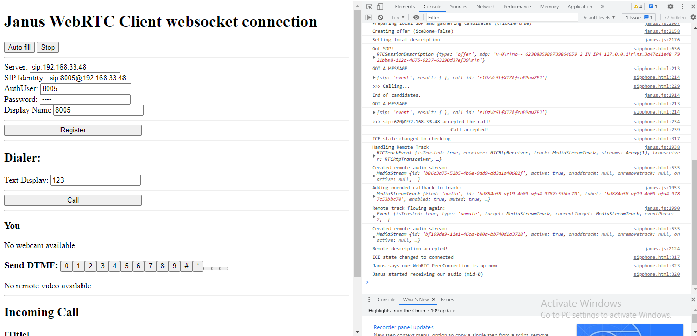

# WEB-JS-JANUSCLIENT

- This is a practical example of a JANUS Gateway web client built in javascript. This is based from janus gateway documentation and example.

## Janus Client Plugins

- `janus.js` -  is designed to be used in conjunction with a web browser. It provides a JavaScript API that allows web applications to access the Janus.js server. This API can be used to create WebRTC-based applications such as video conferencing, audio conferencing, and instant messaging.
- `adapter.js` -  is a JavaScript file that is used to adapt the Janus.js API to different web browsers. This file is necessary because different web browsers have different ways of implementing the WebRTC API. The adapter.js file ensures that the Janus.js API can be used in a consistent way across all web browsers.

## Testing Example
 
- Run `sipphone.html` on your web browser locally. This do not work via remote because you will be required to allow permission like camera and audio.

## Screenshots

## Developer

- [Jerome Soriano](https://github.com/dvxgit-jsoriano)

*"Feel free to read, use, and apply to your projects."*